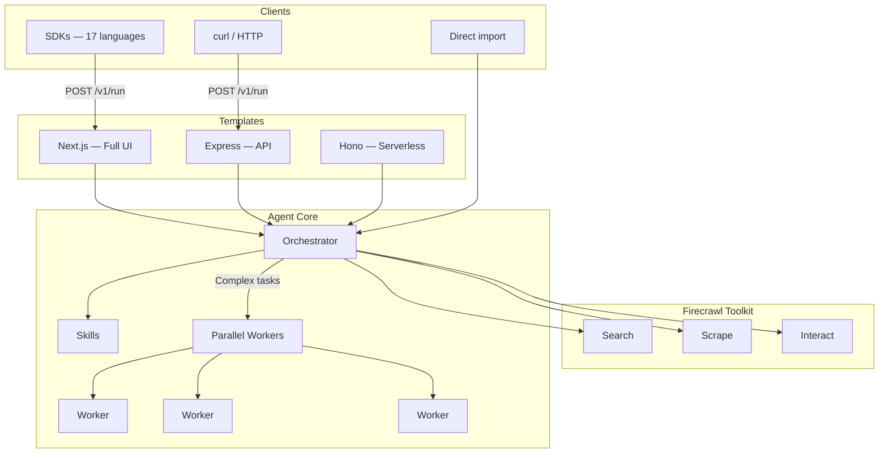

# Firecrawl Agent

AI-powered web research agent. Give it a prompt — it searches, scrapes, and extracts structured data from any website.

Built on [Firecrawl](https://firecrawl.dev/) and [firecrawl-aisdk](https://www.npmjs.com/package/firecrawl-aisdk).

## Get started

### Option 1: CLI

Build the CLI once, then scaffold projects from anywhere:

```bash
cd cli && npm install && npm run build && npm link
```

```bash
firecrawl-agent init my-agent
```

```
? Template
❯ Next.js (Full UI)      Complete web app with chat UI, history, settings
  Express (API only)     Lightweight Node.js API server with /v1/run endpoint
  Hono (Serverless)      Fast, lightweight API — ideal for edge and serverless
```

The CLI auto-detects your Firecrawl API key, scaffolds the project, and installs dependencies. Or skip prompts entirely:

```bash
firecrawl-agent init my-agent -t next                            # Full UI
firecrawl-agent init my-agent -t express --key anthropic=sk-...  # API server with keys
firecrawl-agent init my-agent --from user/repo                   # From external repo
```

See [`cli/`](./cli/) for the full CLI reference.

### Option 2: Clone

```bash
git clone https://github.com/mendableai/firecrawl-agent.git
cd firecrawl-agent
npm install
cp .env.local.example .env.local   # add your FIRECRAWL_API_KEY
npm run dev                         # http://localhost:3000
```

## Architecture



## Use as an API or a library

**API** — deploy any template, call `POST /v1/run` from any language:

```bash
curl -X POST http://localhost:3000/api/v1/run \
  -H "Content-Type: application/json" \
  -d '{"prompt": "Compare pricing for Vercel vs Netlify", "format": "json"}'
```

**Library** — import directly, no server needed:

```typescript
import { createAgent } from '@firecrawl/agent-core'

const agent = createAgent({
  firecrawlApiKey: process.env.FIRECRAWL_API_KEY!,
  model: { provider: 'google', model: 'gemini-3-flash-preview' },
})

const result = await agent.run({ prompt: 'Compare pricing for Vercel vs Netlify' })
```

## Templates

| Template | What you get | Best for |
|----------|-------------|----------|
| [**Next.js**](./templates/next/) | Full web app — chat UI, conversation history, settings, streaming visualization | Teams, demos, full experience |
| [**Express**](./templates/express/) | Lightweight API server with `POST /v1/run` | Backend services, self-hosted |
| [**Hono**](./templates/hono/) | Fast serverless API with SSE streaming | Edge, serverless, Cloudflare |

All templates share the same [agent core](./agent-core/) and expose the same [API](./agent-core/openapi.yaml). Pick the one that fits your stack.

## Project structure

| Directory | What's inside |
|-----------|--------------|
| [`cli/`](./cli/) | CLI tool — `init`, `dev`, `deploy` commands |
| [`agent-core/`](./agent-core/) | Core agent logic, orchestrator, skills, tools, [OpenAPI spec](./agent-core/openapi.yaml) |
| [`templates/`](./templates/) | Server templates — [Next.js](./templates/next/), [Express](./templates/express/), [Hono](./templates/hono/) |
| [`sdks/`](./sdks/) | Auto-generated clients for 17 languages |
| [`examples/`](./examples/) | Working examples for every SDK language |
| [`deploy/`](./deploy/) | Platform configs — [Vercel](./deploy/vercel/), [Railway](./deploy/railway/), [Docker](./deploy/docker/) |

## License

MIT
